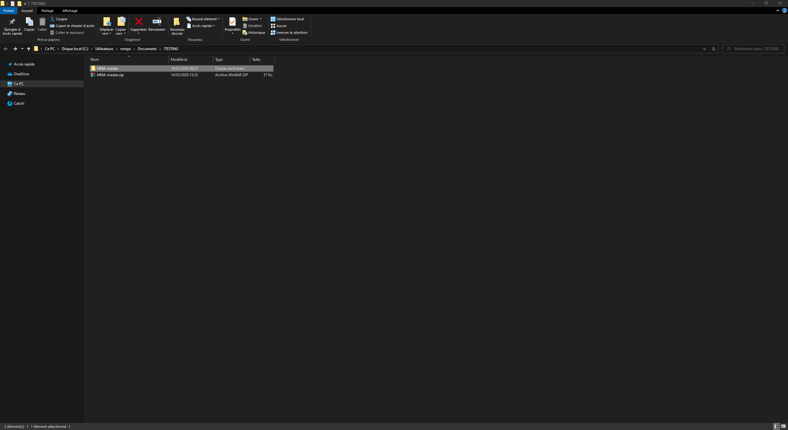

# MNA - Mini Nutritional Assessment
## Summary
- [Links](#links)
- [Use](#use)
- [Installation](#installation)
  * [General installation](#general-installation)
  * [Detailed installation](#detailed-installation)
## Links
<i>Website test link : https://romainpestre-mna.glitch.me</i>

<i>File download link : https://github.com/RomainPestre/MNA/archive/master.zip</i>
## Use
1. Select Language
2. Fill in the personal information
3. Calculate your BMI
4. Submit your information
5. Fill in the form
6. Calculate your malnutrition indicator score

## Installation
### General installation
1. Click on the download link
2. Save the folder in the desired location on the device.
3. Unzip the folder
4. All you have to do is launch the MNA by opening "index.html".
### Detailed installation
Click on the download link

Save the folder in the desired location on the device.

Unzip the folder

Launch index.html

